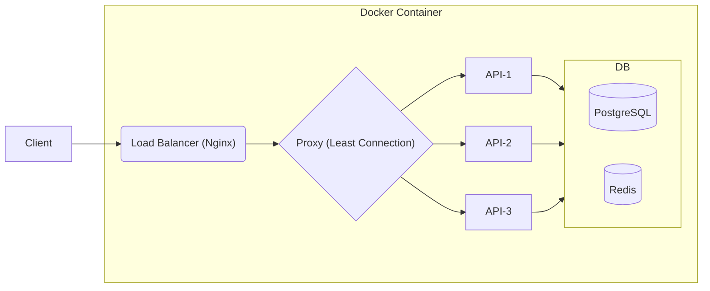

# URL Shortener

## Overview of the Architecture



## Usage

First, install docker, use the following command, and you are ready to go!

```bash
docker compose up
```

## Third Party Libs

Production: `express`, `helmet`, `pg`, `redis`, `pm2`

Reasons why I chose these libs:

- `express` is a fast, and minimal framework for developing web APIs
- `helmet` provides basic security for an `express` app
- `pg` provides an Nodejs interface for PostgreSQL
- `redis` provides an Nodejs interface for Redis
- `pm2` helps manage Node apps and restarts them once they failed

---

Developement: `jest`, `@types/jest`, `nodemon`, `supertest`

Reasons why I chose these libs:

- `jest` provides a soild testing framework for Javascript
- `@types/jest` provides type hints for IDE
- `supertest` provides end-to-end testing tools for web APIs
- `nodemon` helps develop Node app more easily

## Database

- `PostgreSQL` is what I am most familiar with, and other SQL databases, such as `MySQL`, will do given this task
- `Redis` is used for caching short urls from `PostgreSQL`

---

## How I implement an URL shortener

### 1. Shortened URL length

Shortened URL length is important:

1. if it is too long, then it loses the meaning to shorten it

2. if it is too short, then it is likely to consume all possible combinations. 

Observing some popular services of URL shortener (Top 5 google search results), I found the following services and counted possible combinations:

- [shortened Length]: ([Name of services]): [possible words] ** [shortened Length] => [All combinations]

- 5: ([shorturl.at](https://www.shorturl.at/)): [a-zA-Z0-9] ** 5 => 916,132,832

- 6:([rb.gy](https://free-url-shortener.rb.gy/)): [a-zA-Z0-9] ** 6 => 56,800,235,584

- 7: ([bit.ly](https://bitly.com/)): [a-zA-Z0-9] ** 7 => 3,521,614,606,208

Considering the services above, shortened length of `5` will suit this task:

1. Shortend length of `5` is successfully used in production
2. We are building a url shortener that does not have large amount of users.

### Dealing with collisions of short URLs

The function `generateShortUrl()` in `src/api/v1/utils/generateShortUrl.js` checks whether the given url is in database.

If it does exist, it will return itself recursively until a non-repeated short url is generated.

### Caching Strategy

Redis is used to cache short urls for 86400 seconds, namely one day. If the given expiration time is less than 86400 seconds, the expiration time will be counted in seconds and `SETEX` to Redis.

### Test: `Jest`, `SuperTest`

The test coverage of this module is 98.34 %.
There are two pieces of codes not covered, because one occurs when database fails, and the other occurs when database have a random string that a function generates randomly.

## Repeated Long URLs

If a long url is repeated in database, it will return the result of a short url that has generated previously. However, if the expiration time is modified with the same long url, the expiration time in database will not be updated.
If we'd like to update expiration time, a new route should be added: `api/v1/urls/update`
